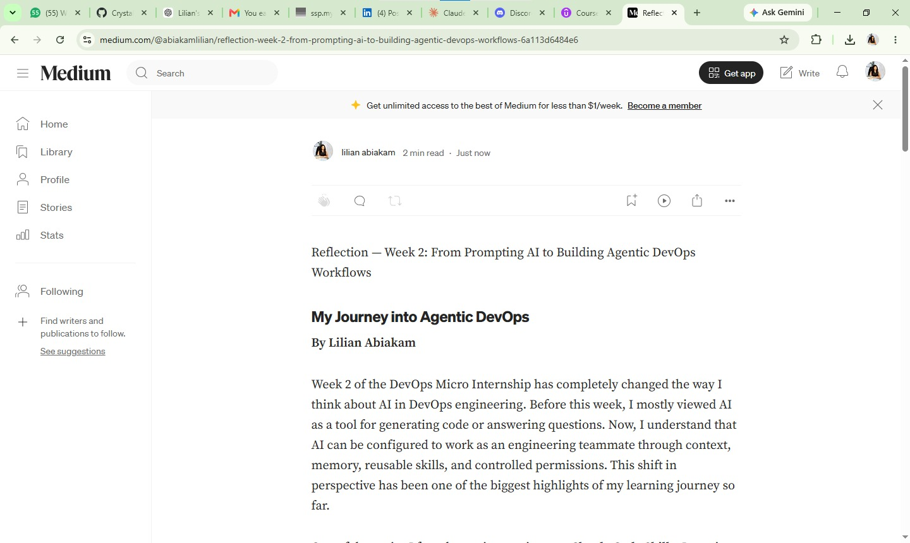
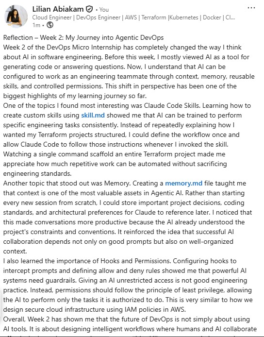

# Assignment 8 — Week 2 Reflection Blog

Part of the DevOps Micro Internship (DMI) Cohort 3 with Agentic AI

---

# Purpose

In this assignment, you will reflect on your Week 2 learning journey and write a short blog capturing your experience working with Agentic AI tools such as Claude Code, Skills, Subagents, MCP, Hooks, Permissions, and Memory.

You will also publish a LinkedIn post summarizing your learning and share both links for evaluation.

---

# Task 1 — Write Your Reflection Blog

## Goal

Write a reflection blog covering your Week 2 learning experience.

### Blog Requirements

Your blog must include:

* Title: **Reflection – Week 2**
* Minimum 300 words
* At least 2–3 topics from Week 2 (Claude Code, Skills, Subagents, MCP, Hooks, Permissions, Memory)
* Honest personal reflection (learning, challenges, mindset)
* One habit/system you plan to implement
* Your full name clearly visible

### Allowed Platforms

You can publish your blog on:

* Hashnode
* Medium
* Dev.to
* LinkedIn Article
* GitHub Markdown file
* Substack

---

### Evidence

#### Screenshot 1 — Blog published and visible



---

### Submission Field

Blog Link:

https://medium.com/@abiakamlilian/reflection-week-2-from-prompting-ai-to-building-agentic-devops-workflows-6a113d6484e6?sharedUserId=abiakamlilian

---

# Task 2 — Create LinkedIn Post

## Goal

Share your Week 2 learning publicly on LinkedIn.

---

### LinkedIn Post Requirements

Your post must include:

* One screenshot from any Week 2 assignment
* Short reflection (what you learned or built)
* Required P.S. line exactly as given below

---

### Required P.S. Line (Must Include Exactly)

> **P.S. This post is a part of DevOps Micro Internship with Agentic AI Cohort-3 by [Pravin Mishra](https://www.linkedin.com/in/pravin-mishra-aws-trainer/). You can start your DevOps journey by joining [DMI waiting list](https://forms.gle/3hvrWJBDzsDeJoPs6) (https://forms.gle/3hvrWJBDzsDeJoPs6).**

---

### Suggested Hashtags

#DMIByPravinMishra #AgenticAI #ClaudeCode #DevOps #LearningInPublic

---

### Evidence

#### Screenshot 2 — LinkedIn post published



---

### Submission Field

LinkedIn Post Content (copy-paste here):

```
Reflection – Week 2: My Journey into Agentic DevOps

Week 2 of the DevOps Micro Internship has completely changed the way I think about AI in software engineering. Before this week, I mostly viewed AI as a tool for generating code or answering questions. Now, I understand that AI can be configured to work as an engineering teammate through context, memory, reusable skills, and controlled permissions. This shift in perspective has been one of the biggest highlights of my learning journey so far.

One of the topics I found most interesting was Claude Code Skills. Learning how to create custom skills using skill.md showed me that AI can be trained to perform specific engineering tasks consistently. Instead of repeatedly explaining how I wanted my Terraform projects structured, I could define the workflow once and allow Claude Code to follow those instructions whenever I invoked the skill. Watching a single command scaffold an entire Terraform project made me appreciate how much repetitive work can be automated without sacrificing engineering standards.

Another topic that stood out was Memory. Creating a memory.md file taught me that context is one of the most valuable assets in Agentic AI. Rather than starting every new session from scratch, I could store important project decisions, coding standards, and architectural preferences for Claude to reference later. I noticed that this made conversations more productive because the AI already understood the project's constraints and conventions. It reinforced the idea that successful AI collaboration depends not only on good prompts but also on well-organized context.

I also learned the importance of Hooks and Permissions. Configuring hooks to intercept prompts and defining allow and deny rules showed me that powerful AI systems need guardrails. Giving an AI unrestricted access is not good engineering practice. Instead, permissions should follow the principle of least privilege, allowing the AI to perform only the tasks it is authorized to do. This is very similar to how we design secure cloud infrastructure using IAM policies in AWS.

This week was not without challenges. I encountered issues with Git, Markdown image paths, hook configuration, and even accidentally committed large Terraform provider files that GitHub refused to accept because of the file size limit. Although these problems were frustrating, they helped me improve my troubleshooting skills. Rather than looking for shortcuts, I learned to read error messages carefully, understand the root cause, and apply the correct solution.

Overall, Week 2 has shown me that the future of DevOps is not simply about using AI tools. It is about designing intelligent workflows where humans and AI collaborate effectively through structured context, reusable skills, secure permissions, and disciplined engineering practices. I am excited to continue building on these concepts as I progress through the internship.

P.S. This post is a part of DevOps Micro Internship with Agentic AI Cohort-3 by Pravin Mishra. You can start your DevOps journey by joining this Discord community ( [https://discord.pravinmishra.com/](https://discord.pravinmishra.com/) ).
```

---

### LinkedIn Post Link:

`https://www.linkedin.com/feed/update/urn:li:share:7481341505182412800/__

---

# Submission Instructions

* Blog must be publicly accessible
* LinkedIn post must be visible (public or unlisted where applicable)
* All required fields must be filled
* Screenshot proofs must be added to GitHub repository
* Do not include sensitive information in blog or post

---

# Completion Checklist

* [ ] Blog written with required structure
* [ ] Blog includes at least 2–3 Week 2 topics
* [ ] Blog is publicly accessible
* [ ] LinkedIn post created
* [ ] Required P.S. line included
* [ ] LinkedIn post content copied in submission field
* [ ] Blog link added
* [ ] LinkedIn post link added
* [ ] Screenshots added to GitHub repo

---

# About DMI & CloudAdvisory

DevOps Micro Internship (DMI) is a project-based DevOps program run by Pravin Mishra (The CloudAdvisory), focused on real-world execution, systems thinking, and agentic AI workflows.

It helps learners build strong DevOps foundations through hands-on experience.

---

# Resources

* 🌐 DMI Official Website: [https://pravinmishra.com/dmi](https://pravinmishra.com/dmi)
* 🎓 DevOps for Beginners (Udemy): [https://www.udemy.com/course/devops-for-beginners-docker-k8s-cloud-cicd-4-projects/](https://www.udemy.com/course/devops-for-beginners-docker-k8s-cloud-cicd-4-projects/)
* 🎓 Agentic AI DevOps with Claude Code: [https://www.udemy.com/course/ultimate-agentic-ai-devops-with-claude-code/](https://www.udemy.com/course/ultimate-agentic-ai-devops-with-claude-code/)
* 🎓 DevOps with Claude Code: Terraform, EKS, ArgoCD & Helm: [https://www.udemy.com/course/devops-with-claude-code-terraform-eks-argocd-helm/](https://www.udemy.com/course/devops-with-claude-code-terraform-eks-argocd-helm/)
* ▶️ YouTube Playlist: [https://www.youtube.com/playlist?list=PLFeSNDtI4Cho](https://www.youtube.com/playlist?list=PLFeSNDtI4Cho)
* 🔗 Pravin Mishra (LinkedIn): [https://www.linkedin.com/in/pravin-mishra-aws-trainer/](https://www.linkedin.com/in/pravin-mishra-aws-trainer/)
* 🏢 CloudAdvisory (LinkedIn): [https://www.linkedin.com/company/thecloudadvisory/](https://www.linkedin.com/company/thecloudadvisory/)

