# Assignment 3 — Production Maintenance Drill (OPS Checklist)

Part of the DevOps Micro Internship (DMI) Cohort 3 with Agentic AI

---

## Purpose

In this assignment, you will treat your already deployed React application (on Ubuntu VM with Nginx) as a live production system. You will perform structured operational checks covering network validation, service health, log analysis, resource monitoring, configuration verification, and incident simulation with recovery — mirroring real on-call DevOps responsibilities.

---

# Task 1 — Server Access & Networking Validation

## Goal

Verify that the deployed React application is reachable from the browser and confirm basic network connectivity of the Ubuntu VM.

### Evidence

#### Screenshot 1 — Browser showing the React app with your Full Name visible on the UI

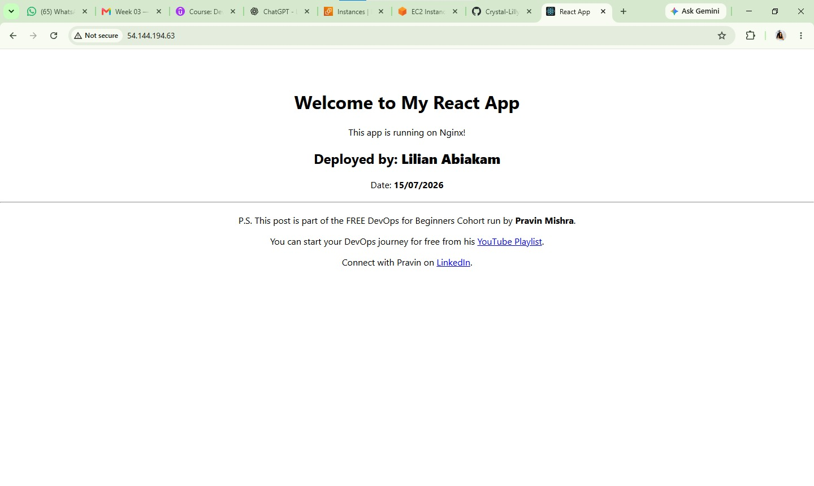

---

#### Screenshot 2 — Output of `ip a`

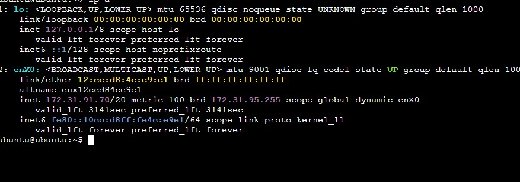

---

#### Screenshot 3 — Output of `sudo ss -tulpen`

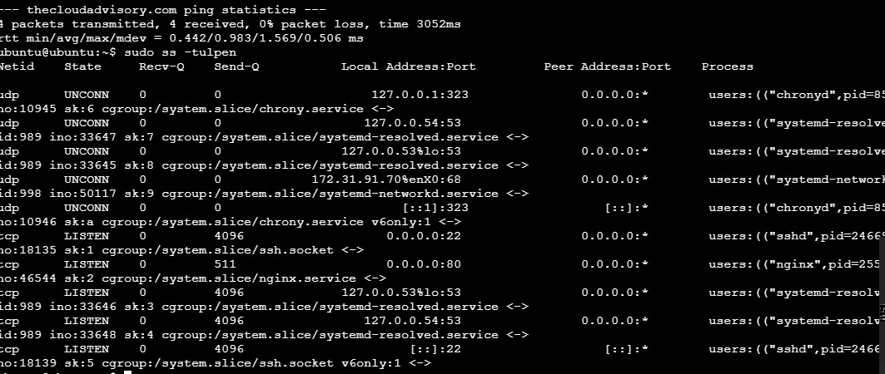

---

#### Screenshot 4 — Output of `sudo ufw status`

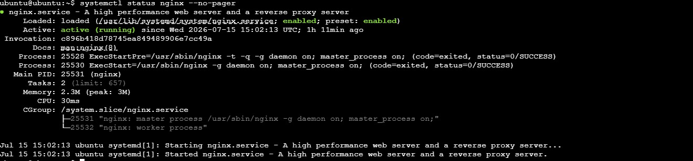

---

### Notes

Answer the following in your own words:

**1. What proves Nginx is listening on 0.0.0.0:80?**

I was able to access the server using http meaning nginx is listening on port 80 also the output of the sudo ss -tlnp | grep :80 command showed 0.0.0.0:80 in the LISTEN state.

---

**2. What proves SSH is active on port 22?**

The server accepted my SSH connection, and the output of sudo ss -tlnp | grep :22 showed that the SSH service (sshd) was listening on port 22.

---

**3. Did you find any unexpected open ports? Explain briefly.**

No. The only open ports were port 22 for SSH and port 80 for HTTP, which are the expected ports required to manage the server and serve the web application.

---

# Task 2 — Service Health & Systemd Validation (Nginx)

## Goal

Verify that Nginx is properly installed, running, enabled at boot, and safely configured.

### Evidence

#### Screenshot 1 — Output of `systemctl status nginx --no-pager`

---

#### Screenshot 2 — Output of `sudo nginx -t`

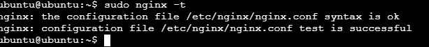

---

#### Screenshot 3 — Output of `sudo ss -lptn '( sport = :80 )'`

---

### Notes

Answer the following in your own words:

**1. What happens if Nginx fails to restart in production?**

If Nginx fails to restart, the web application becomes unavailable to users, and they may receive connection errors or be unable to access the website. This can cause service downtime until the issue is identified and resolved.

---

**2. What's your basic rollback plan?**

My basic rollback plan is to restore the previous working Nginx configuration from the backup, test the configuration using sudo nginx -t, and then restart the Nginx service. This ensures the application returns to its last known working state while I investigate the cause of the failure.

---

# Task 3 — Logs & Request Trace

## Goal

Verify real traffic flow and analyze logs to understand system behavior and errors.

### Evidence

#### Screenshot 1 — Output of `sudo tail -n 30 /var/log/nginx/access.log`

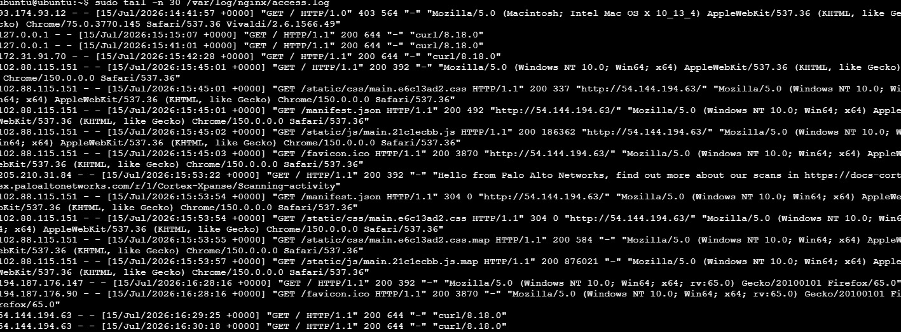

---

#### Screenshot 2 — Output of `sudo tail -n 30 /var/log/nginx/error.log`

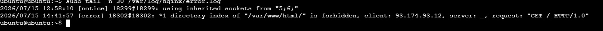

---

#### Screenshot 3 — Output of `sudo journalctl -u nginx --no-pager -n 50`

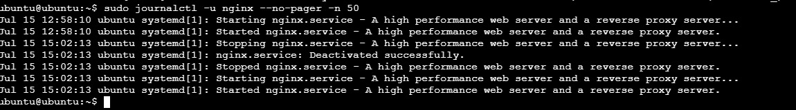

---

### Notes

Answer the following in your own words:

**1. Were there any errors in the logs?**

- If yes, mention 1–2 example error lines from the logs and explain what each one means in simple terms.
- If no, explain what it means if the error log is empty or shows no recent errors during your check.

Yes, there was an error recorded in the Nginx error log.
[error] *1 directory index of "/var/www/html/" is forbidden
This means Nginx received a request for the website, but it could not find a default page (such as index.html) to display or directory listing was not allowed at that time. As a result, access to the directory was denied.

Another log entry was:request: "GET / HTTP/1.0"
This shows that a client requested the root (/) of the website. Combined with the previous error, it indicates that Nginx could not serve the requested page during that request

---

**2. If there were no errors, what does that indicate about the system?**

it will indicates that Nginx was operating normally during the period I checked and no new issues were recorded. However, this does not guarantee the system is permanently error-free; it only means no problems occurred during the time covered by the logs.

---

**3. Based on the access logs, were your curl requests visible in the log entries? What does that prove about traffic flow?**

Yes. My curl requests were visible in the access log.
This proves that the requests successfully reached the Nginx server, were processed correctly, and the server returned an HTTP 200 (OK) response. It confirms that traffic was flowing properly between the client and the web server

---

# Task 4 — System Resource Health Check (Capacity Red Flags)

## Goal

Assess server capacity and detect potential performance or failure risks.

### Evidence

#### Screenshot 1 — Output of `uptime`

---

#### Screenshot 2 — Output of `free -h`

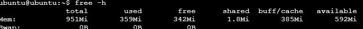

---

#### Screenshot 3 — Output of `df -h`

---

#### Screenshot 4 — Output of `sudo du -sh /var/* | sort -h`

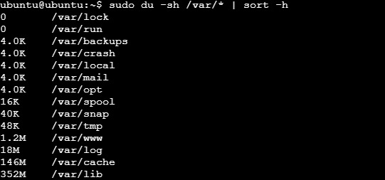

---

### Notes

Answer the following in your own words:

**1. Which resource looks most critical right now? (CPU/load, memory, or disk) Explain why.**

The disk usage is the most important resource to monitor. The df -h output shows that the root partition (/) is 59% full, while the CPU load is low and there is still over 590 MB of available memory. Although 59% is not critical yet, disk space can fill up over time because of logs, application files, and updates, so it should be monitored regularly to prevent future issues.

---

**2. What happens if disk becomes 100% full in a production server?**

If the disk becomes 100% full, the server may no longer be able to write new files or logs. Applications can fail because they cannot save data, logs may stop recording important events, and the server may become slow, unstable, or even unresponsive. This can lead to service downtime and make troubleshooting much more difficult

---

# Task 5 — Configuration & Deployment Verification

## Goal

Ensure the correct React build is deployed and Nginx is serving it properly.

### Evidence

#### Screenshot 1 — Output of `ls -lah /var/www/html | head -n 20`

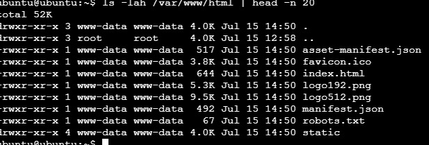

---

#### Screenshot 2 — Output of `grep -R "Deployed by" -n /var/www/html 2>/dev/null | head`

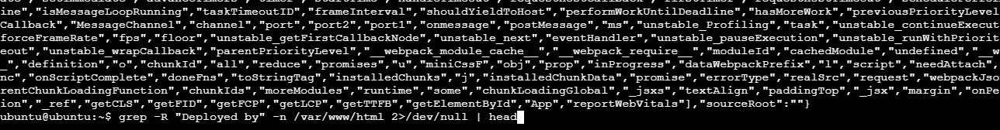

---

#### Screenshot 3 — Output of `grep -n "try_files" /etc/nginx/sites-available/default`

---

### Notes

Answer the following in your own words:

**1. How do you confirm that the correct version of the application is deployed?**

I confirmed the correct version of the application was deployed by running `ls -lah /var/www/html` and verifying that the React production files, including `index.html` and the `static` folder, were present. I also checked that my custom “Deployed by <Your Name>” change was included, confirmed that Nginx was using `/var/www/html` as its web root, and finally opened the application in the browser to ensure the updated version loaded correctly.

---

# Task 6 — Nginx Configuration Failure Simulation

## Goal

Simulate a real-world Nginx misconfiguration and recover the service safely.

### Evidence

#### Screenshot 1 — Output of `sudo nginx -t` showing the syntax error (broken config)

---

#### Screenshot 2 — Output of `sudo nginx -t` showing syntax ok (fixed config)

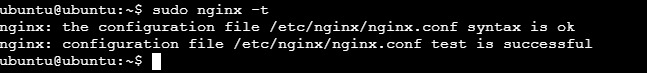

---

#### Screenshot 3 — Output of `curl -I http://<public-ip>` confirming recovery (200 OK)

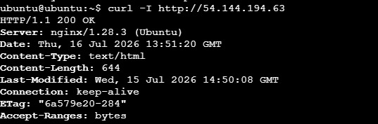

---

### Notes

Answer the following in your own words:

**1. What caused the configuration failure?**

The configuration issue was caused by the ; i removed from the ngibx file

---

**2. How did you fix the issue?**

i replaced the ; i removed and it wad fine

---

**3. How can you avoid this kind of issue in real production systems?**

be very careful to avoid even the smallest identation mistake

---

# Task 7 — Web Application Failure Simulation

## Goal

Simulate missing deployment content and recover the application safely.

### Evidence

#### Screenshot 1 — Output of `curl -I http://<public-ip>` showing failure (non-200 response)

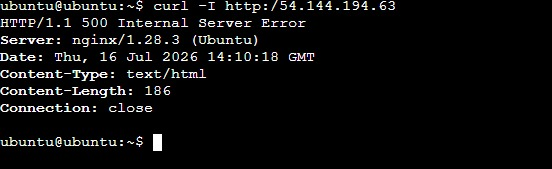

---

#### Screenshot 2 — Output of `curl -I http://<public-ip>` confirming recovery (200 OK)

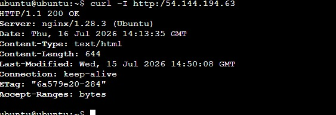

---

### Notes

Answer the following in your own words:

**1. What caused the application to break in this scenario?**

var/www/html content was moved to a backup file leaving the new var/www/html empty

---

**2. How did you fix the issue and restore the application?**

var/www/html content was moved back into the file

---

**3. What steps would you take to prevent this kind of issue in real production systems?**

i will make sure the file is not empty and has the correct content

---

# Task 8 — Security & Reliability Review

## Goal

Review and reflect on the security and reliability practices applied during this assignment.

### Security & Reliability Notes

Answer the following in your own words:

**1. Why is SSH key-based authentication more secure than sharing passwords?**

SSH key-based authentication is more secure because it uses a pair of cryptographic keys instead of a simple password. The private key stays on the user's computer and is never shared with the server, while the public key is stored on the server. This makes it much harder for attackers to gain access through password guessing or brute-force attacks.

---

**2. Why should only required ports be open on a production server?**

Only necessary ports should be open because every exposed port creates a possible entry point for attackers. By allowing only required services, we reduce the server's attack surface and minimize the risk of unauthorized access or security vulnerabilities.

---

**3. Why is it important for Nginx to be enabled on boot?**

Nginx should be enabled on boot so that it automatically starts whenever the server restarts. This ensures that websites and applications become available without requiring an administrator to manually start the service after every reboot.

---

**4. What are the risks of sharing secrets, keys, or credentials publicly?**

Sharing secrets, API keys, SSH keys, or credentials publicly can allow unauthorized users to access systems, databases, cloud resources, or sensitive information. Attackers can use exposed credentials to steal data, modify resources, or create unexpected costs.

---

**5. Why should cloud resources be stopped or terminated when they are no longer needed?**

Cloud resources should be stopped or terminated when they are no longer needed to avoid unnecessary costs and reduce security risks. Unused servers can still consume money, expose applications, and become targets for attackers if they are not properly maintained. Cleaning up unused resources helps maintain a secure and cost-efficient cloud environment.

---

# LinkedIn Post (Required)

## Evidence

#### LinkedIn Post URL

Paste your LinkedIn post URL here:

`_https://www.linkedin.com/feed/update/urn:li:ugcPost:7483603421141499905/

---

#### Screenshot — Published LinkedIn post

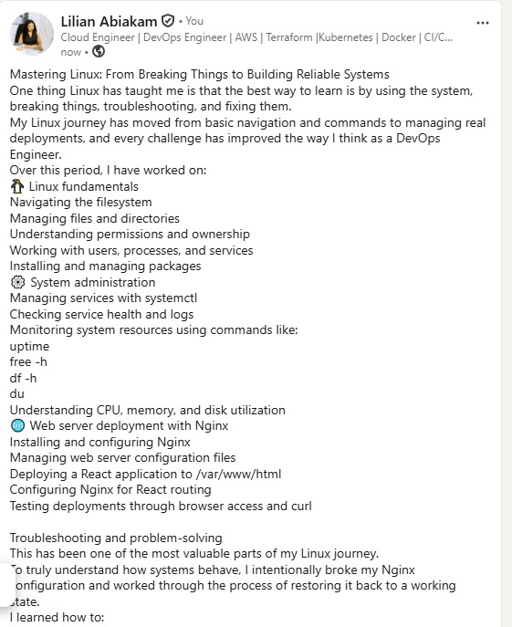

---

# Submission Instructions

- Add all required screenshots in your submission
- Full name must be visible in required screenshots
- Do not expose sensitive information (keys, passwords, account IDs)

---

# Completion Checklist

- [ ] Task 1: Screenshots (browser, ip a, ss -tulpen, ufw status) + Notes answered
- [ ] Task 2: Screenshots (nginx status, nginx -t, ss port 80) + Notes answered
- [ ] Task 3: Screenshots (access log, error log, journalctl) + Notes answered
- [ ] Task 4: Screenshots (uptime, free -h, df -h, du -sh) + Notes answered
- [ ] Task 5: Screenshots (ls html, grep deployed by, grep try_files) + Notes answered
- [ ] Task 6: Screenshots (nginx -t fail, nginx -t pass, curl recovery) + Notes answered
- [ ] Task 7: Screenshots (curl failure, curl recovery) + Notes answered
- [ ] Task 8: Security & Reliability Notes answered
- [ ] LinkedIn post published and URL submitted
- [ ] Full Name visible in all required screenshots
- [ ] No sensitive data exposed

---

## 📌 About DMI & CloudAdvisory

DevOps Micro Internship (DMI) is a project-based DevOps program run by Pravin Mishra (The CloudAdvisory) focused on real-world execution, systems thinking, and career readiness.

It helps learners build strong DevOps foundations with hands-on experience.

---

## 📌 Resources

- 🌐 DMI Official Website: https://pravinmishra.com/dmi  
- 🎓 DevOps for Beginners (Udemy): https://www.udemy.com/course/devops-for-beginners-docker-k8s-cloud-cicd-4-projects/  
- 🎓 Agentic AI DevOps with Claude Code: https://www.udemy.com/course/ultimate-agentic-ai-devops-with-claude-code/  
- 🎓 DevOps with Claude Code: Terraform, EKS, ArgoCD & Helm: https://www.udemy.com/course/devops-with-claude-code-terraform-eks-argocd-helm/  
- ▶️ YouTube Playlist: https://www.youtube.com/playlist?list=PLFeSNDtI4Cho  
- 🔗 Pravin Mishra (LinkedIn): https://www.linkedin.com/in/pravin-mishra-aws-trainer/  
- 🏢 CloudAdvisory (LinkedIn): https://www.linkedin.com/company/thecloudadvisory/

---

*This submission is part of DevOps Micro Internship (DMI) Cohort 3 — Agentic AI Track.*