# Assignment 5 — Bash Script Automation Drill (OPS Checklist)

Part of the DevOps Micro Internship (DMI) Cohort 3 with Agentic AI

---

## Purpose

In this assignment, you will practice Bash scripting by building a series of small automation scripts covering environment setup, variables, arrays, loops, file conditionals, if-else logic, and functions. These scripts form the foundation of real-world Linux automation used in DevOps, cloud, and production support environments.

---

# Task 1 — Bash Environment & Workspace Setup

## Goal

Verify that Bash is available on your system and create a clean workspace for this assignment.

### Evidence

#### Screenshot 1 — Output of `echo $SHELL` and `bash --version`

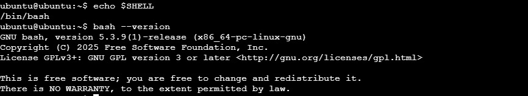

---

#### Screenshot 2 — Output of `pwd` and `ls -lah` showing the scripts directory

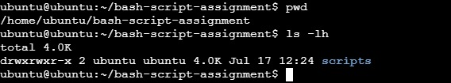

---

### Notes

Answer the following in your own words:

**1. What is Bash?**

Bash (Bourne Again SHell) is a command-line shell and scripting language used in Linux and Unix-based operating systems. It allows users to interact with the operating system by running commands, managing files, configuring systems, and automating tasks through scripts.

---

**2. What is the difference between shell and Bash?**

A shell is a general program that provides an interface between the user and the operating system. It interprets commands and executes them.

Bash is a specific type of shell. There are different shells available, such as Bash, Zsh, and Fish. Bash is one of the most commonly used shells in Linux environments and provides additional features like scripting, variables, loops, and automation capabilities.

---

**3. Why is it important to confirm the Bash version before writing scripts?**

It is important to confirm the Bash version because different versions may support different features and syntax. Writing a script using commands or features that are unavailable in an older version can cause errors or unexpected behavior. Checking the Bash version ensures that scripts are compatible with the target environment and will run reliably.

---

# Task 2 — Your First Bash Script

## Goal

Create your first Bash script, make it executable, and run it from the terminal.

### Evidence

#### Screenshot 1 — Content of `first-script.sh`

---

#### Screenshot 2 — Output of `./first-script.sh`

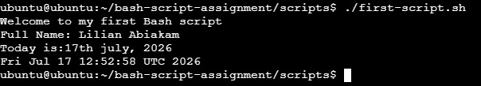

---

#### Screenshot 3 — Output of `ls -l first-script.sh` showing executable permission

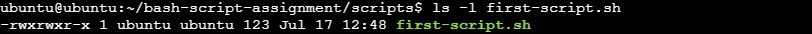

---

### Notes

Answer the following in your own words:

**1. What is the purpose of `#!/bin/bash`?**

It tells the operating system which interpreter should be used to execute the script. In this case, it specifies that the script should run using the Bash shell located at /bin/bash.

This ensures that the script is executed with the correct shell and that Bash-specific commands and features are supported.

---

**2. Why do we use `chmod +x` before running a script?**

We use chmod +x to give the script execute permission. By default, a newly created script may only have read and write permissions, which prevents it from being executed directly.

---

**3. What is the difference between running a script using `./script.sh` and `bash script.sh`?**

./script.sh runs the script as an executable file. It requires Execute permission (chmod +x) abd a valid shebang line (such as #!/bin/bash)

bash script.sh directly tells the Bash interpreter to execute the file. It does not require execute permission or a shebang line because Bash is explicitly specified.

---

# Task 3 — Variables: User Information Script

## Goal

Use variables to store and display user-related information.

### Evidence

#### Screenshot 1 — Content of `user-info.sh`

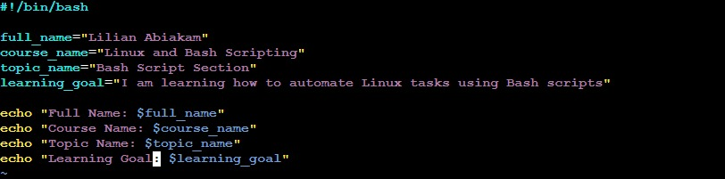

---

#### Screenshot 2 — Output of `./user-info.sh`

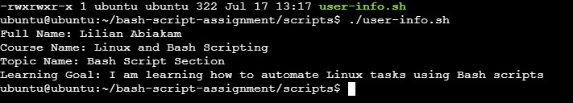

---

### Notes

Answer the following in your own words:

**1. What is a variable in Bash?**

A variable in Bash is a name used to store a value that can be reused later in a script or command. Variables can store different types of information such as text, numbers, file paths, or command results

---

**2. Why should we avoid spaces around the `=` sign when creating variables?**

In Bash, spaces around the = sign are not allowed because Bash interprets the command differently.

---

**3. How do you access the value stored inside a Bash variable?**

You access the value of a Bash variable by placing a $ symbol before the variable name.

---

# Task 4 — Arrays & Loops: Tools Checklist Script

## Goal

Use arrays and loops to print a checklist of tools used in Bash scripting.

### Evidence

#### Screenshot 1 — Content of `tools-checklist.sh`

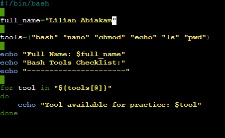

---

#### Screenshot 2 — Output of `./tools-checklist.sh`

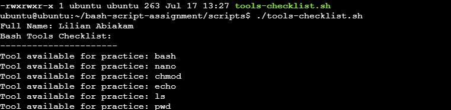

---

### Notes

Answer the following in your own words:

**1. What is an array in Bash?**

An array in Bash is a variable that can store multiple values under a single name. Instead of creating separate variables for each item, an array allows you to group related values together and access them individually

---

**2. Why are arrays useful in scripts?**

Arrays are useful because they make it easier to manage and process multiple related items. They allow scripts to store lists of values and perform actions on each item using loops.

---

**3. What does `"${tools[@]}"` mean?**

"${tools[@]}" is used to access all elements inside the Bash array named tools.

---

**4. What is the purpose of the `for` loop in this script?**

The for loop is used to repeat a set of commands for each item in the array.

---

# Task 5 — Loops: Number Counter Script

## Goal

Use loops to repeat a task multiple times.

### Evidence

#### Screenshot 1 — Content of `counter.sh`

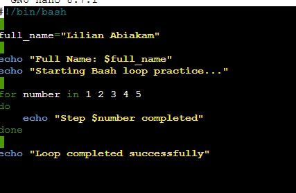

---

#### Screenshot 2 — Output of `./counter.sh`

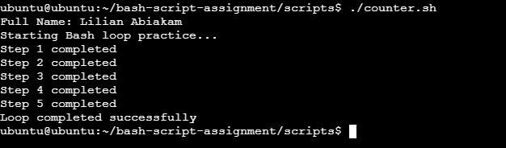

---

### Notes

Answer the following in your own words:

**1. What is a loop?**

A loop is a programming structure that allows a set of commands to be executed repeatedly until a specific condition is met or until all items in a list have been processed.

---

**2. Why do we use loops in Bash scripting?**

Loops are used in Bash scripting to automate repetitive tasks and reduce the need to write the same commands multiple times. They make scripts more efficient when performing actions such as processing files, checking systems, installing software, or managing multiple resources.

---

**3. How many times did the loop run in your script?**

5 times

---

**4. What would you change if you wanted the loop to run 10 times?**

instead of for number in 1 2 3 4 5 , i will extend it to for number in 1 2 3 4 5 ---- 10

---

# Task 6 — Files & Conditionals: File Validation Script

## Goal

Use file checks and conditionals to verify whether files and directories exist.

### Evidence

#### Screenshot 1 — Output of `ls -lah ../test-folder`

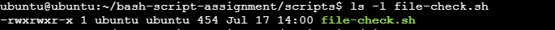

---

#### Screenshot 2 — Content of `file-check.sh`

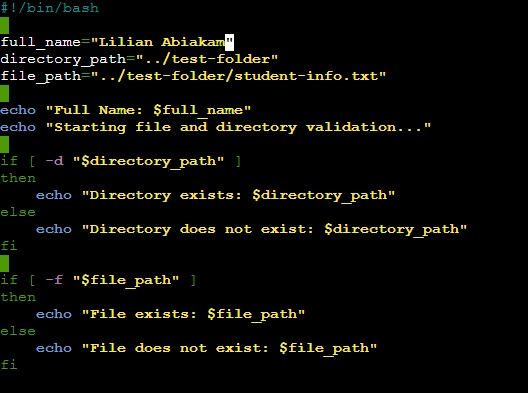

---

#### Screenshot 3 — Output of `./file-check.sh`

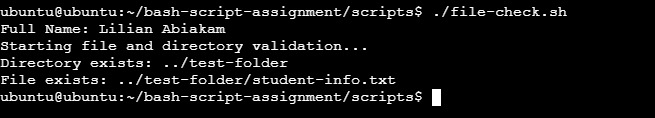

---

### Notes

Answer the following in your own words:

**1. What does `-d` check in Bash?**

-d checks whether a specified path exists and is a directory.

---

**2. What does `-f` check in Bash?**

-f checks whether a specified path exists and is a regular file.

---

**3. Why should file and directory paths be stored in variables?**

File and directory paths should be stored in variables because it makes scripts easier to read, maintain, and modify. If the path changes, we only need to update the variable instead of changing it in multiple places throughout the script.

---

**4. What happens if the file does not exist?**

If the file does not exist, the -f check returns false, and the script can handle the situation using an if statement.

---

# Task 7 — Conditionals: Pass or Retry Script

## Goal

Use if-else conditionals to make decisions based on a variable value.

### Evidence

#### Screenshot 1 — Content of `score-check.sh` with `score=85`

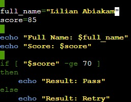

---

#### Screenshot 2 — Output showing `Result: Pass`

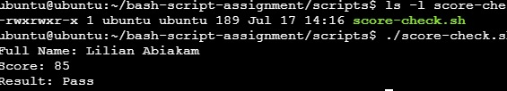

---

#### Screenshot 3 — Content of `score-check.sh` with `score=55`

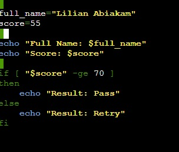

---

#### Screenshot 4 — Output showing `Result: Retry`

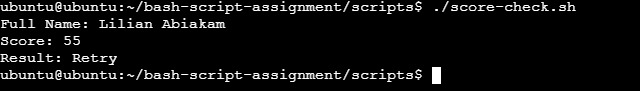

---

### Notes

Answer the following in your own words:

**1. What is the purpose of if-else in Bash?**

if-else statements are used in Bash scripts to make decisions based on conditions. They allow the script to perform different actions depending on whether a condition is true or false.

---

**2. What does `-ge` mean?**

-ge means "greater than or equal to" in Bash conditional expressions.

---

**3. Why should conditions be tested with different values?**

Conditions should be tested with different values to make sure the script behaves correctly in different situations. Testing different inputs helps identify errors and ensures the script handles expected and unexpected cases properly.

---

**4. How can conditionals help in automation scripts?**

Conditionals help automation scripts make decisions automatically without manual intervention. They allow scripts to check situations and perform the correct action based on the result.

---

# Task 8 — Functions: Final Bash Automation Script

## Goal

Create a final Bash script using functions to organize reusable code.

### Evidence

#### Screenshot 1 — Content of `final-automation.sh`

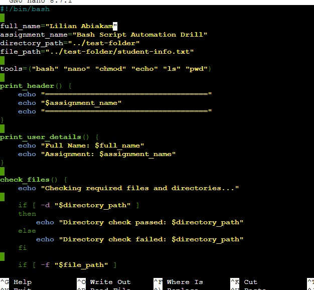

---

#### Screenshot 2 — Output of `./final-automation.sh`

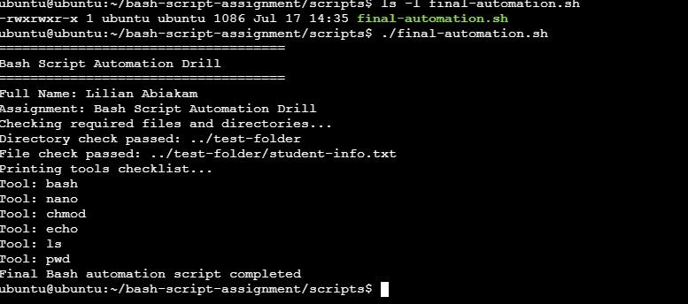

---

#### Screenshot 3 — Output of `ls -lah` showing all created scripts

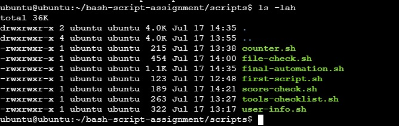

---

### Notes

Answer the following in your own words:

**1. What is a function in Bash?**

A function in Bash is a reusable block of code that performs a specific task. Instead of writing the same commands multiple times, a function allows those commands to be grouped together and called whenever they are needed.

---

**2. Why are functions useful in scripts?**

Functions are useful because they make scripts more organized, easier to read, and easier to maintain. They reduce code duplication and allow specific tasks to be reused throughout the script.

---

**3. Which functions did you create in this script?**

print_header()
print_user_details()
check_files()
print_tools()

---

**4. How does this final script combine variables, arrays, loops, conditionals, files, and functions?**

This final Bash automation script combines different Bash concepts to create a structured automation workflow
Variables are used to store reusable information such as the full name, assignment name, directory path, and file path. This makes the script easier to update and maintain.

Arrays are used to store multiple tool names in the tools array

Loops are used inside the print_tools() function to go through each item in the tools array and print every tool automatically.

Conditionals are used inside the check_files() function to verify whether the required directory and file exist. The script uses:

-d to check if the directory exists.
-f to check if the file exists.

Files and directories are handled through the stored paths:

Functions organize the script into separate reusable sections, making the automation process cleaner and easier to understand

---

# LinkedIn Post (Required)

## Evidence

#### LinkedIn Post URL

Paste your LinkedIn post URL here:

<<<<<<< HEAD
_https://www.linkedin.com/feed/update/urn:li:ugcPost:7483912994842886144/_
=======
`Add your URL here`
>>>>>>> upstream/main

---

#### Screenshot — Published LinkedIn post

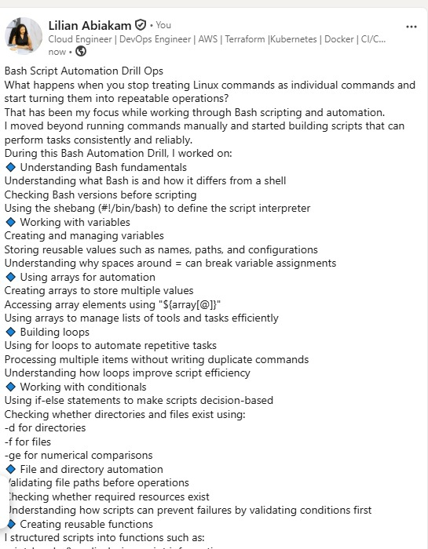

---

# Submission Instructions

- Add all required screenshots in your submission
- Full name must be visible in required screenshots
- All script files must be created and run successfully
- Required notes must be answered clearly for every task
- Do not expose sensitive information (keys, passwords, credentials)

---

# Completion Checklist

- [ ] Task 1: Environment setup verified, workspace created (Screenshots 1–2, Notes answered)
- [ ] Task 2: First script created, executed, permissions verified (Screenshots 1–3, Notes answered)
- [ ] Task 3: Variables script created and run (Screenshots 1–2, Notes answered)
- [ ] Task 4: Arrays and loops script created and run (Screenshots 1–2, Notes answered)
- [ ] Task 5: Counter loop script created and run (Screenshots 1–2, Notes answered)
- [ ] Task 6: File validation script created and run (Screenshots 1–3, Notes answered)
- [ ] Task 7: Pass/Retry conditional script tested with both values (Screenshots 1–4, Notes answered)
- [ ] Task 8: Final automation script created and run (Screenshots 1–3, Notes answered)
- [ ] All scripts run without errors
- [ ] Full Name visible in all required screenshots
- [ ] LinkedIn post published and URL submitted
- [ ] No sensitive data exposed

---

## 📌 About DMI & CloudAdvisory

DevOps Micro Internship (DMI) is a project-based DevOps program run by Pravin Mishra (The CloudAdvisory) focused on real-world execution, systems thinking, and career readiness.

It helps learners build strong DevOps foundations with hands-on experience.

---

## 📌 Resources

- 🌐 DMI Official Website: https://pravinmishra.com/dmi  
- 🎓 DevOps for Beginners (Udemy): https://www.udemy.com/course/devops-for-beginners-docker-k8s-cloud-cicd-4-projects/  
- 🎓 Agentic AI DevOps with Claude Code: https://www.udemy.com/course/ultimate-agentic-ai-devops-with-claude-code/  
- 🎓 DevOps with Claude Code: Terraform, EKS, ArgoCD & Helm: https://www.udemy.com/course/devops-with-claude-code-terraform-eks-argocd-helm/  
- ▶️ YouTube Playlist: https://www.youtube.com/playlist?list=PLFeSNDtI4Cho  
- 🔗 Pravin Mishra (LinkedIn): https://www.linkedin.com/in/pravin-mishra-aws-trainer/  
- 🏢 CloudAdvisory (LinkedIn): https://www.linkedin.com/company/thecloudadvisory/

---

*This submission is part of DevOps Micro Internship (DMI) Cohort 3 — Agentic AI Track.*